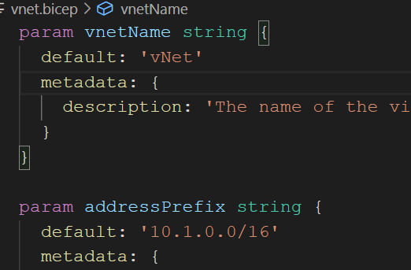
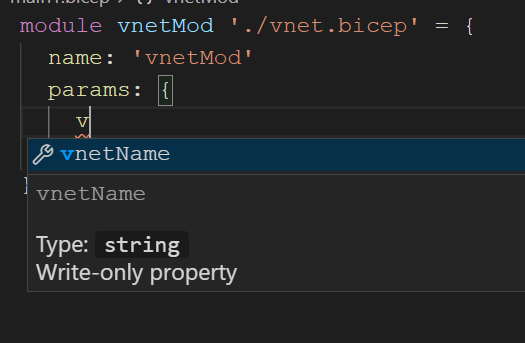

<style>
@import url('https://fonts.googleapis.com/css2?family=Noto+Sans+JP:wght@700&display=swap');
section {
    font-family: 'Noto Sans JP', sans-serif;
}
</style>

# bicep :muscle:
<!-- _class: right -->


[Tokyo Jazug Night #29](https://jazug.connpass.com/event/194512/)

###### by Takekazu Omi(*@Baleen.Studio*)

###### 2020/11/25 v1.0.0


# 自己紹介

近江 武一 [@takekazuomi](https://twitter.com/takekazuomi)

- 会社作りました [baleen.studio](https://baleen.studio)
- [GitHub](https://github.com/takekazuomi)
  - Azure Quickstart template の elastic poolのBUG修正[PR](https://github.com/Azure/azure-quickstart-templates/pull/8440)
  - Azurite で、Table APIサポートを作り始めたので[PR](https://github.com/Azure/Azurite/pull/522)
- Blog [kyrt.in](https://kyrt.in)
  - [bicep 用 dev contaner](https://kyrt.in/2020/10/27/bicep_devcontaner.html)
  - [bicep moduleを使う](https://kyrt.in/2020/10/18/bicep_module.html)

# **bicep :muscle: の短い紹介**

GitHubのレポジトリ [bicep](https://github.com/Azure/bicep)

- Azure ARM Template のDSL、現在開発初期の[v0.2.59 (alpha)](https://github.com/Azure/bicep/releases/tag/v0.2.59)
- json 直は辛い。DSLとLanguage Serverでサポートというのが基本アイデア
- ARM Template <-> bicep 間は薄いラッパーで相互変換も可
- ARM Template をIL(ターゲット）とした、コンパイラ（Transpilers）
- シングルバイナリー(.NET Core製)で、クロスプラットフォーム

# **bicep :muscle:の** :+1: :-1:

- :+1:
  - ARM Template直よりは100倍楽に書ける
  - 薄いラッパーなので、トラブルシューティングが楽
- :-1:
  - 未実装機能がある、copy,condition  [Known limitations](https://github.com/Azure/bicep#known-limitations)
  - ↑ 0.3 (ETA 1/31) ではサポートされる予定

ARM template のライティングツールの位置付けなら今からでも :smile:

# **bicepの取組む課題**

ARM Template は中々難しい。根本的な難しさは３つに分類できる

1. JSON構文の煩雑さ
2. モジュール化、再利用性の困難性
3. Azure Managemnet APIの複雑さと不透明性

※`Terraform`とか`Pulumi`に行く手もあるが、`bicep`でアプローチ

# **1. JSON構文の煩雑さ**

DSLの導入でARM TemplateのJSON構文よりシンプルに[例:Storage account](https://github.com/takekazuomi/devcontainer-bicep/blob/main/src/simple-storage.bicep)

1. 文字列内に`[...]`で埋め込んでいるが式が直接書けるようになる
2. プロパティ名をいちいち、`"` で囲む必要が無い
3. 文字列結合を、`concat()`を使わずに、`'${name}-vm'` のように書ける
4. `reference(parameters('aksName')).properties.fqdn)` の代わりに、`aks.properties.fqdn` のようにプロパティアクセスで書ける

# **2. モジュール化、再利用困難性(1)**

- 複数のbicepファイルに分割、 [modules](https://github.com/Azure/bicep/blob/main/docs/spec/modules.md) 構文で再利用できる
- moduleのパラメータ部分の補完が効く

 

# **2. モジュール化、再利用困難性(2)**

- bicep moduleはコンパイル時にパラメータチェックされ
- 変換後は、`Microsoft.Resources/deployments` の[インラインテンプレート](https://gist.github.com/takekazuomi/b8a53ae815062b6a4d5e63e363ede0f5#file-bicep-module-results-json-L32 )になる

参考：
- 関連 Issue: [intellisense metadata/description が出ない](https://github.com/Azure/bicep/issues/960)
- [bicep moduleを使う](https://kyrt.in/2020/10/18/bicep_module.html) <- 0.2からサポート

# **3. Azure Management APIの複雑さと不透明性**

これは、元々のAPIの問題で`bicep`のARM templateのDSLというコンセプトではなんともし難い。基本2択問題

- レイヤーを重ねて、作り込んだレイヤーの課題(BUG)に付き合うか、< `Terraform, Pulumi`
- 元々のAPIの課題に直接取り組むか < `bicep`

課題への取り組み方の問題

# **decompile**

最新の [v0.2.59 (alpha)](https://github.com/Azure/bicep/releases/tag/v0.2.59)には、ARM Template -> bicep 変換の最初のリリースが入っている。こんな感じで使う

```shell
bicep decompile azueredeploy.json
```

## 未実装

- copy loops、condition、nested templates、cross-scope linked templates
- [Decompiling an ARM Template](https://github.com/Azure/bicep/blob/main/docs/decompiling.md)

# まとめ

`bicep` は、ARM Template の生産性を上げるツールとして秀逸。ARM（腕）、bicep（上腕二頭筋）という名前付けらしい。読み方は、[バイセップ](https://youtu.be/ykHA5QTYlDc?t=2)

- 今回のコンテンツ、
  - GitHub [jazugn29-bicep](https://github.com/takekazuomi/jazugn29-bicep)
  - slide share [jazugn29-bicep](https://www.slideshare.net/takekazuomi/jazugn29bicep)
- Powerd by [Marp](https://github.com/marp-team/marp-cli#docker)。ありがとうございました。

# 終


