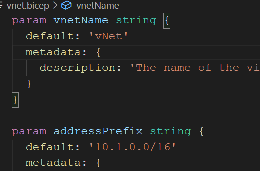

<style>
@import url('https://fonts.googleapis.com/css2?family=Noto+Sans+JP:wght@700&display=swap');
section {
    font-family: 'Noto Sans JP', sans-serif;
}
</style>

# bicep :muscle:
<!-- _class: right -->


[Build 2021 (たぶん)最速Recap Day](https://jazug.connpass.com/event/211563/)

###### by Takekazu Omi(*@Baleen.Studio*)

###### 2021/05/29 v1.0.0


# 自己紹介

近江 武一 [@takekazuomi](https://twitter.com/takekazuomi)

- 所属 [jazug](https://r.jazug.jp/)、[baleen.studio](https://baleen.studio)（[仲間を募集中](https://www.wantedly.com/projects/624553)）
- [GitHub](https://github.com/takekazuomi)、Azure関連のPull request、気がついたら直す方向で
  - Private AKS Cluster の`.bicep`を[PR](https://github.com/Azure/bicep/pull/2155)
  - SQL Elastic Pool のTemplate が動かなくなってたので [PR](https://github.com/Azure/azure-quickstart-templates/pull/8440)
- Blog [kyrt.in](https://kyrt.in)、[zenn.dev](https://zenn.dev/takekazuomi)を使い始めた
  - [ARM tempate DSL、Bicep を使おう(1)](https://zenn.dev/takekazuomi/articles/bicep-getting-started)
  - [ARM tempate DSL、Bicep を使おう(2)](https://zenn.dev/takekazuomi/articles/bicep-getting-started2)

# 今日の話 :muscle:

- //Build 2021で、Bicep 0.4 が発表
  - 発表は、[Ask the Experts: Infra as Code - Bicep](https://mybuild.microsoft.com/sessions/6967b6ae-4dad-417f-8a94-f3b53fed130e)
- Bicep の紹介
  - そもそも、Bicep is 何？
- Bicep 0.4 詳細
  - Demonなど

# //Build 2021

- //Build 2021 で、**Bicep 0.4** :+1: が ~~リリース~~
  - リリースは、6/2 予定
- リリースイベント[Bicep v0.4 Launch Call](https://twitter.com/BicepLang/status/1397340232706498560)、参加しよう！
- 未リリース :sweat: だけど
  - [Nightlyのインストール](https://github.com/Azure/bicep/blob/main/docs/installing-nightly.md) で試せるので是非

//Buildに間に合うかと思ったが、惜しかった

# **Bicep :muscle:の** :+1: :-1:

## Bicepの紹介


# **Bicep :muscle: の短い紹介**

GitHubのレポジトリ [bicep](https://github.com/Azure/bicep)

- Azure ARM Template のDSL、現在プレビューの[v0.3.539](https://github.com/Azure/bicep/releases/tag/v0.3.539)
  - json 直は辛い。DSL と Language Server で記述しやすく
  - プレビューだけど、MS 公式Azureサポートの対象
- ARM Template <-> bicep 間は薄いラッパーで相互変換も可
  - ARM Template をILとした、トランスパイラ
  - 類似: JavaScript(ARM Tempate) <-> TypeScript(Bicep)

# **Bicep :muscle:の** :+1:

- ARM Template直より100倍楽に書けるシンプルな構文
- Azure RP の Day 0 サポート
- モジュール化、再利用性の向上
- Language Server 同時開発
- 構文のデプロイ前検証

# **Bicepの取組む課題**

ARM Template は中々難しい。根本的な難しさは３つに分類できる

1. JSON構文の煩雑さ
2. モジュール化、再利用性の困難性
3. Azure Template Runtime/Azure RPの複雑さと不透明性

# **1. JSON構文の煩雑さ(1)**

DSLの導入でARM TemplateのJSON構文よりシンプル。[例](https://zenn.dev/takekazuomi/articles/bicep-getting-started2#%E3%83%91%E3%83%A9%E3%83%A1%E3%83%BC%E3%82%BF%E3%83%BC%E3%81%A8%E5%A4%89%E6%95%B0%E3%81%AE%E5%B1%95%E9%96%8B)

1. 文字列内に`[...]`で埋め込んでいるが式が直接書けるようになる
2. プロパティ名をいちいち、`"` で囲む必要が無い
3. 文字列結合を、`concat()` では無く `'${name}-vm'` のように書ける
4. `reference(parameters('aksName')).properties.fqdn)` の代わりに、`aks.properties.fqdn` のようにプロパティアクセスで書ける

# **2. モジュール化、再利用困難性(1)**

- 複数のbicepファイルに分割、 [modules](https://github.com/Azure/bicep/blob/main/docs/spec/modules.md) 構文で再利用できる
- moduleのパラメータ部分の補完が効く

 

# **2. モジュール化、再利用困難性(2)**

- bicep moduleはコンパイル時にパラメータチェックされ
- 変換後は、`Microsoft.Resources/deployments` の[インラインテンプレート](https://gist.github.com/takekazuomi/b8a53ae815062b6a4d5e63e363ede0f5#file-bicep-module-results-json-L32 )になる

参考：

- [bicep moduleを使う](https://kyrt.in/2020/10/18/bicep_module.html) <- 0.2からサポート

# **1. JSON構文の煩雑さ(2)**

module と　loop を使った例

- [loop 例](https://gist.github.com/takekazuomi/d26613bf9e10a4f085e5f0218b90c106#file-main-bicep-L5-L13)
- [vm module](https://gist.github.com/takekazuomi/d26613bf9e10a4f085e5f0218b90c106#file-vm-bicep)

# **3. Azure Template Runtime/Azure RPの複雑さと不透明性**

これは、元々のAPIの問題で `bicep` は、そのレイヤーを解決するツールでは無い

Bicep Team ≒ ARM Tempate Team「問題があるなら、SR切るか、Issue上げて欲しいとのこと」

[参考](https://twitter.com/takekazuomi/status/1397407482473975808)

# **Decompile**

[v0.2.59](https://github.com/Azure/bicep/releases/tag/v0.2.59)から、ARM Template -> bicep 変換の最初のリリースが入っている。

```shell
bicep decompile azueredeploy.json
```

生成後の`.bicep` を名前を直して使っているが、結構イケてる。

# **Bicep 0.4 の新機能**

- The new Bicep linter
- Resource Snippets
- Resource and module scaffolding
- The getSecret() function for retrieving secrets for module params
- Bicep visualizer

Demo

# Bicep linter

[Linter](https://github.com/Azure/bicep/blob/v0.4.1/docs/linter.md), [ルール](https://github.com/Azure/bicep/tree/v0.4.1/docs/linter-rules)

- [Environment URL がハードコードされています](https://github.com/Azure/bicep/blob/v0.4.1/docs/linter-rules/no-hardcoded-env-urls.md)
- [パラメータが使われていません](https://github.com/Azure/bicep/blob/v0.4.1/docs/linter-rules/no-unused-params.md)
- [変数が使われていません](https://github.com/Azure/bicep/blob/v0.4.1/docs/linter-rules/no-unused-vars.md)
- [文字列補間を使いましょう](https://github.com/Azure/bicep/blob/v0.4.1/docs/linter-rules/prefer-interpolation.md)
- [secure parameter にデフォルトがあります](https://github.com/Azure/bicep/blob/v0.4.1/docs/linter-rules/secure-parameter-default.md)
- [文字列補間は必要ありません](https://github.com/Azure/bicep/blob/v0.4.1/docs/linter-rules/simplify-interpolation.md)

# getSecret()

secure な string の module のパラメータに、Key Vault からの既存のシークレットを使用する。[例](https://github.com/Azure/bicep/blob/906394fa1f7c71b3c5a288c922b82c8c08da8d16/docs/spec/modules.md#using-existing-key-vaults-secret-as-input-for-secure-string-module-parameter)

```yaml
module secretModule './secretModule.bicep' = {
  name: 'secretModule'
  params: {
    myPassword: kv.getSecret(secret1Name, secret1Version)
    mySecondPassword: kv.getSecret(secret2Name)
  }
}
```

# Known limitations

- object と arrays を1行に書けない (例 ['a', 'b', 'c']) ([#586](https://github.com/Azure/bicep/issues/586)).
- 今のBicep は改行に厳しすぎる。過剰なルールを緩めたい。([#146](https://github.com/Azure/bicep/issues/146))
- すべてのリソースで個々にapiVersionを指定する必要があります。議論は [#622](https://github.com/Azure/bicep/issues/622) にあります。

# まとめ

`bicep` は、ARM Template の生産性を上げるツールとして秀逸。ARM（腕）、bicep（上腕二頭筋）という名前付けらしい。読み方は、[バイセップ](https://youtu.be/ykHA5QTYlDc?t=2)

- 今回のコンテンツ、
  - GitHub [20210529-build202-bicep](https://github.com/takekazuomi/slide/blob/main/docs/20210529-build202-bicep.md)
  - slide share [20210529-build202-bicep](https://www.slideshare.net/takekazuomi/build-2021-bicep-04)
- Powerd by [Marp](https://github.com/marp-team/marp-cli#docker)。ありがとうございました。

# 終


