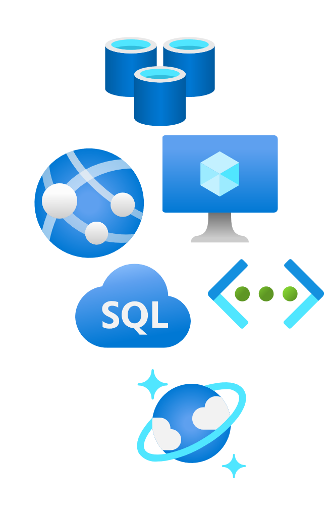

# Bicep:muscle:+VSCode  楽々 Azure Deploy
<!-- _class: right -->

[VSCode Conference Japan 2021](https://jazug.connpass.com/event/223585/)

###### by Takekazu Omi(*@Baleen.Studio*)

###### 2021/11/20 v1.0.0

# 自己紹介

近江 武一 [@takekazuomi](https://twitter.com/takekazuomi)

- 所属 [JAZUG](https://r.jazug.jp/)、[baleen.studio](https://baleen.studio)（[仲間を募集中](https://www.wantedly.com/projects/624553)）
- [GitHub](https://github.com/takekazuomi)
  - Azure Container Apps の[サンプルプロジェクト](https://github.com/takekazuomi/container-apps05)
  - [bicepのオレオレdevconainer](https://github.com/takekazuomi/devcontainer-bicep)
- Blog [kyrt.in](https://kyrt.in) から [zenn.dev](https://zenn.dev/takekazuomi) へ移動（したい）
  - [ARM tempate DSL、Bicep を使おう(1)](https://zenn.dev/takekazuomi/articles/bicep-getting-started)
  - [ARM tempate DSL、Bicep を使おう(2)](https://zenn.dev/takekazuomi/articles/bicep-getting-started2)

# 今日の話 :muscle:

今日は、Bicep と VSCodeの話をします。

- そもそも、Bicep って何？
- VSCodeとBicepの関係
- Demo
- おまけ（時間があれば）

# Bicepの誕生

- Azure では、VM、Webサーバー、データーベースなど全てはリソース
- ARM Templateでは宣言的にリソース構成を定義できる

## :cold_sweat: :cold_sweat: ARM Template :cold_sweat: :cold_sweat:

そこで :point_right: Bicep 誕生 :muscle: @2020/9

# **Bicep :muscle: の短い紹介**

- 公式ドキュメント
  - [https://docs.microsoft.com/.../bicep/overview](https://docs.microsoft.com/ja-jp/azure/azure-resource-manager/bicep/overview>)
- MS Learn、Bicep 概要
  - [https://docs.microsoft.com/.../introduction-to-infrastructure-as-code-using-bicep/](https://docs.microsoft.com/ja-jp/learn/modules/introduction-to-infrastructure-as-code-using-bicep/)
- ソースコード、GitHub
  - <https://github.com/Azure/bicep>

# もう少し詳しく

- 宣言型の構文のドメイン固有言語 (DSL)
- 簡潔な構文
- 信頼性の高いタイプ セーフ
- コード再利用のサポート
- ARM Templateに1:1で対応するトランスパイラ

## :muscle: :muscle: :muscle:

# **bicep :muscle:の** :+1: :-1

- :+1:
  - ARM Template直より100倍楽に書ける
  - 薄いラッパーなので、トラブルシューティングが楽
- :-1:
  - ARM Template の根本的制約は解決できない
    - ↑このアタリは別途

# Bicep + VSCode

- Bicepの良さの半分はVCodeで出来ている
- Azure リソースの型情報を使って、VSCode上でLangage Serverを動かしてインテリセンスを実装
- 型情報は、[azure-rest-api-specs](https://github.com/Azure/azure-rest-api-specs/blob/b49af808cba06f45b01193623ce1ff9e2e017777/specification/containerregistry/resource-manager/Microsoft.ContainerRegistry/preview/2021-06-01-preview/containerregistry.json#L3960-L3980)を元に作ってる
  - api specs が間違っていることがあるが、積極的に直す方針らしい :smile:
    - <https://github.com/Azure/bicep/issues/4577>

# 解決への道

- 型を導入
- JSONの廃止して独自構文

※ ARM Template と Bicepの関係は、JavaScript とTypeScriptに類似

# 型の導入

- 元々Azure Resource には型がある
- api specs として、型情報が公開されている
  - swagger(Open API)
- ここから、型情報を作る
  - <https://github.com/Azure/bicep-types-az>
- 出来上がったものは、nugetにある
  - <https://www.nuget.org/packages/Azure.Bicep.Types.Az/>
  - <https://www.nuget.org/packages/Azure.Bicep.Types/>
  - Type情報の実体は、
    - api spec から抜き出して、作ったJSONをリソースで埋め込んでる。

# Bicep LanguageServer

- <https://github.com/Azure/bicep/tree/main/src/Bicep.LangServer>
  - Bicep.LangServer.dll
  - 型情報があるので、エディターでの自動補完の範囲が増えた

# Demo

<https://github.com/Azure/bicep/tree/main/src/vscode-bicep>

1. Dot-property access
2. Resource property names & property values
3. List all available resource types
4. Snippets
5. Find all references, peek references
6. Outline view and breadcrumb view
7. Refactoring

# どんなAzureの新機能でも対応

Azure Native APIなので、新機能にも即時に対応できる。
しかし、ドキュメントがなかったり、肝心の型情報が無かったりで結構辛い。
例: Azure Container Apps

# 最後に

来週 11/25 20時から Tokyo Jazug Night でBicepの話をします

<https://jazug.connpass.com/event/228575/>

興味がある方は是非

# 今回のコンテンツ

- GitHub [20211120-vscode-bicep](https://github.com/takekazuomi/slide/blob/main/docs/20211120-vscode-bicep.md)
- Slide share [20211120-vscode-bicep](https://www.slideshare.net/takekazuomi/bicep-mysql/takekazuomi/?)
- Powerd by [Marp](https://github.com/marp-team/marp-cli#docker)。ありがとうございました ::

# 終

