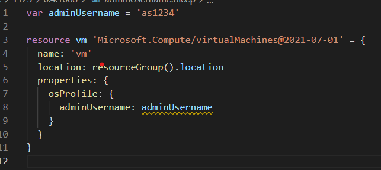
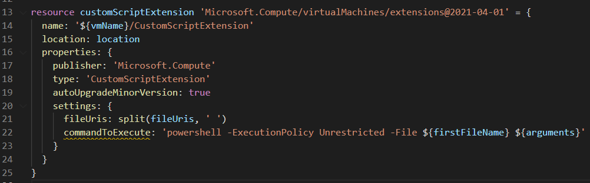

<style>
@import url('https://fonts.googleapis.com/css2?family=Noto+Sans+JP:wght@700&display=swap');
section {
    font-family: 'Noto Sans JP', sans-serif;
}
</style>

# Bicep:muscle: 0.5 pre
<!-- _class: right -->


<a data-flickr-embed="true" href="https://www.flickr.com/photos/takekazuomi/9204729213/in/datetaken-public/" title="IMG_1308"></a><script async src="//embedr.flickr.com/assets/client-code.js" charset="utf-8"></script>

[第33回 Tokyo Jazug Night](https://jazug.connpass.com/event/228575/)

###### by Takekazu Omi(*@Baleen.Studio*)
###### 2021/11/25 v1.0.0


# 自己紹介

近江 武一 [@takekazuomi](https://twitter.com/takekazuomi)

- 所属 [JAZUG](https://r.jazug.jp/)、[baleen.studio](https://baleen.studio)（[仲間を募集中](https://www.wantedly.com/projects/624553)）
- [GitHub](https://github.com/takekazuomi)
  - Azure Container Apps の[サンプルプロジェクト](https://github.com/takekazuomi/container-apps05)
  - [bicepのオレオレdevconainer](https://github.com/takekazuomi/devcontainer-bicep)
- Blog [kyrt.in](https://kyrt.in) から [zenn.dev](https://zenn.dev/takekazuomi) へ移動（したい）
  - [ARM tempate DSL、Bicep を使おう(1)](https://zenn.dev/takekazuomi/articles/bicep-getting-started)
  - [ARM tempate DSL、Bicep を使おう(2)](https://zenn.dev/takekazuomi/articles/bicep-getting-started2)

# 今日の話 :muscle:

## 今日は、Bicep 0.4以降に追加された機能の話をします

0.5の話をする予定だったのですが、まだ出てないので、、、、

# **Bicep :muscle: の短い紹介**

- 公式ドキュメント
  - [https://docs.microsoft.com/.../bicep/overview](https://docs.microsoft.com/ja-jp/azure/azure-resource-manager/bicep/overview>)
- MS Learn、Bicep 概要
  - [https://docs.microsoft.com/.../introduction-to-infrastructure-as-code-using-bicep/](https://docs.microsoft.com/ja-jp/learn/modules/introduction-to-infrastructure-as-code-using-bicep/)
- ソースコード、GitHub
  - <https://github.com/Azure/bicep>

# 0.4以降のリリース履歴

2021/06/02　v0.4.1　//Build 2021

- 06/05 0.4.63　 Bug fix, ドキュメント改善
- 07/16 0.4.412　jsonサポート改善
- 07/22 0.4.451　Bug fix, ドキュメント改善
- 08/11 0.4.613　VSCode 改善
- 10/16 0.4.1008　private モジュール対応
- 11/23 0.4.1090 ・・・ main branch、未リリース

# 2021/06/05

<p style="font-size:400%;text-align:center">0.4.63</p>
<p style="text-align:center">Bug fix, ドキュメント改善</p>

# 2021/7/16

<p style="font-size:400%;text-align:center">0.4.412</p>

# list method call

```js
resource sa 'Microsoft.Storage/storageAccounts@2021-06-01' = {
  name: 'demosa${uniqueString(resourceGroup().id)}'
  ...
}

output key string = sa.listKeys().keys[0].value
```

- [list*の関数](https://docs.microsoft.com/en-us/azure/azure-resource-manager/templates/template-functions-resource#list)をリソースのメソッドとして記載
- 旧: `listKeys(sa.id, sa.apiVersion).keys[0].value`

# JSON literal

```js
var jsonVar = json('{"hello":"world"}')
var foo = jsonVar.hello

var jsonVar2 = json(loadTextContent('./jsonVar.json'))
var boo = jsonVar2.hello
```

- リテラルでjsonでオブジェクトを初期化、補完が効く
- `loadTextContent` と組み合わせて別ファイルにjsonを置ける
- 注: `loadTextContent`はコンパイル時にインライン展開される

# json templates as modules

```js
module sa './storage.json' = {
  name: 'sa'
  params: {
    name: 'jzugdemo01'
  }
}
```

- storage.json は、ARM Template
- 拡張子は、`json`, `jsonc`, `arm`のいずれか

# ファイルをbase64文字列で読む

```js
var binary = loadFileAsBase64('base64.data')
```

- VMのosProfile.customDataや、KeyVaultの証明書などbase64で受け取る場合に利用
- [例:](https://github.com/takekazuomi/simple-flatcar) (間に合えば)
- 公式: [loadFileAsBase64](https://docs.microsoft.com/en-us/azure/azure-resource-manager/bicep/bicep-functions-files#loadfileasbase64)

# 2021/8/11

<p style="font-size:400%;text-align:center">0.4.613</p>
<p style="text-align:center">VSCode 周りの機能強化</p>

# 2021/10/16

<p style="font-size:400%;text-align:center">0.4.1008</p>

# Private Module Registry

- ドキュメント:
  - [Private registryの作成](https://docs.microsoft.com/azure/azure-resource-manager/bicep/private-module-registry)
  - [Registry内のモジュールの参照](https://docs.microsoft.com/azure/azure-resource-manager/bicep/modules#file-in-registry)
  - [Publish](https://docs.microsoft.com/azure/azure-resource-manager/bicep/bicep-cli#publish) と [restore](https://docs.microsoft.com/azure/azure-resource-manager/bicep/bicep-cli#restore) コマンド
  - `bicepconfig.json` での registry aliases の定義
- *Note:* public registry は、Bicep v0.5 (ETA early November) の予定

# Private Module

```sh
$ bicep publish storage.bicep --target br:acrjazug01wv7qxzdehff2c.azurecr.io/bicep/modules/storage:v1   
```

```js
module sa 'br:acrjazug01wv7qxzdehff2c.azurecr.io/bicep/modules/storage:v1' = {
  name: 'sa'
  params: {
    prefix: 'sajzugdemo01'
  }
}
```

- br が、bicep moduleで、tsでTemplate Specを指定
- acrのフルパスの部分は、alias を切れる

# module alias:  bicepconfig.json

```json
"moduleAliases": {
  "br": {
    "modules": {
      "registry": "acrjazug01wv7qxzdehff2c.azurecr.io",
      "modulePath": "bicep/modules"
      ...
```

```js
module sa 'br/modules:storage:v1' = {
  ...
```

- `br/modules:` コロンの前にaliasを書く

# TemplateSpec module

- Template specs をモジュールのソースにできる
- 例: module tsDeploy 
  - `ts:<<SUB-GUID>>/<<RG-NAME>>/<<TEMPLATE-SPEC-NAME:<<VERSION>> = {...}`
- 例: alias: module tsDeploy 
  - `ts/myAlias:<<TEMPLATE-SPEC-NAME>>:<<VERSION>> = {...}`

# items()  辞書 から 配列に変換

```js
var keys = {
  key1: {
    foo: true
    woo: 100
  }
  key2: {
    foo: false
    woo: 200
...
var r = [for k in items(keys): {
  key: k.key
  foo: k.value.foo
  woo: k.value.woo
}]
```

# items() 結果

```json
"value": [
  {
    "foo": true,
    "key": "key1",
    "woo": 100
  },
  {
    "foo": false,
    "key": "key2",
    "woo": 200
  }
]
```

# adminUsernameのリテラル指定



- [Linterのルール](https://docs.microsoft.com/ja-jp/azure/azure-resource-manager/bicep/linter)

# 2021/11/23

<p style="font-size:400%;text-align:center">その後のPR</p>
<p style="text-align:center">その、いくつかをピックアップ</p>

# PR を見る

```sh
$ gh pr list -s merged  --search "merged:2021-10-16..2021-11-30 base:main sort:updated-desc"

Showing 30 of 82 pull requests in Azure/bicep that match your search

#5203  database, security, storage visualizer icons                              wedoazure:main
#4925  linter: use-protectedsettings-for-commandtoexecute-secrets                sw/protected-settings-rule
#5189  Removed empty functions property from being emitted.                      davidcho23:main
#5198  Updated to c# 10                                                          majastrz/net6-cleanup
#4693  Bump monaco-editor-webpack-plugin from 4.1.2 to 4.2.0 in /src/playground  dependabot/npm_and_yarn/src/playground/monaco-editor-webpack-plugin-...
#4936  Updated to .net 6                                                         majastrz/net6
#5188  Flow declared type information to function arguments                      ant/5187
#5182  fix: correct "as" typo to "at"                                            johnnyreilly:patch-1
#5145  Implement type completions & validation for resource list functions       ant/exp/list_funcs
#5168  Updated Compute and Web visualizer icons                                  wedoazure:main
#5175  Fix KeyNotFoundException when rebuilding source files with external m...  shenglol/fix-#5152
#5107  Add ability to suppress next line diagnostics inline                      DisableDiagnosticInline
#5174  Don't parse DateTime when loading JSON templates                          shenglol/disable-datetime-handling
#5170  Acquire file lock before writing template spec modules                    shenglol/fix-#5159
#5158  Visualizer improvements                                                   shenglol/visualizer-improvements
#5075  Improve `string` + `string` error message                                 tsunkaraneni/stringadditionerror
#4945  "Insert Resource" command implementation                                  ant/feat/import_resource
#5143  Fix inline dependency check for resource access syntaxes                  shenglol/fix-issue-#4850
#5130  updated Networking visualizer icons                                       wedoazure:main
#5140  Remove "preview" flag from VSCode extension                               anthony-c-martin-patch-1
#5139  Updated ARM and ACR SDKs                                                  majastrz/update-acr-sdk
#5137  Add other useful CLI utils to devcontainer                                ant/devcontainer
#5128  Fix highlight.js finding keywords in strings                              ant/issue5127
```

# PR 続き

```sh
#5097  Add live tests for module aliases                                         shenglol/module-alias-live-tests
#5019  Extensible resource code generation                                       ant/ext_codegen
#5066  Provide better error info on getting repro root failure                   sw/baseinehelper-err
#4838  New linter rule no-unnecessary-dependson                                  sw/dependson4
#5058  Workaround for NBGV OSX build issue                                       anthony-c-martin-patch-1
#5049  Bump esbuild-loader module                                                ant/bump_esbuild_loader
#5039  Migrate brew to https://github.com/Azure/homebrew-bicep                   ant/migrate_brew
```

- .NET 6、C# 10になってる。
- 多すぎるので、機能のものだけを選択したら2個に、、、

# #4925  linter シークレットの利用



- [Use protectedSettings for commandToExecute secrets](https://github.com/Azure/bicep/blob/main/docs/linter-rules/use-protectedsettings-for-commandtoexecute-secrets.md)

# #4925  linter シークレットの利用(2)

```js
protectedSettings: {
  commandToExecute: 'powershell -ExecutionPolicy Unrestricted -File ${firstFileName} ${arguments}'
}
```

- protectedSettingsに書くと、仮想マシンの中だけでdecrypted できる形式で暗号化されて送られる
- 参照:[Use the Azure Custom Script Extension Version 2 with Linux virtual machines](https://docs.microsoft.com/en-us/azure/virtual-machines/extensions/custom-script-linux#extension-schema)

# #4945 "Insert Resource" command

リソースIDを指定して、`bicep resource` を作るやつ

Demo(時間があれば)

# おまけ

Visualizer のアイコンがリッチになった。

# 今回のコンテンツ

- GitHub [20211125-jazug33-bicep](https://github.com/takekazuomi/slide/blob/main/docs/20211125-jazug33-bicep.md)
- Slide share [20211125-jazug33-bicep](https://www.slideshare.net/takekazuomi/jazug33-bicep)
- Powerd by [Marp](https://github.com/marp-team/marp-cli#docker)。ありがとうございました :thumbsup:

# 終


