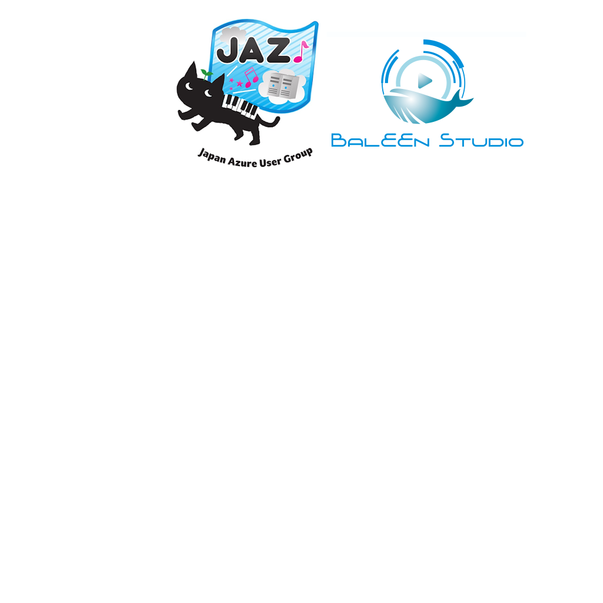
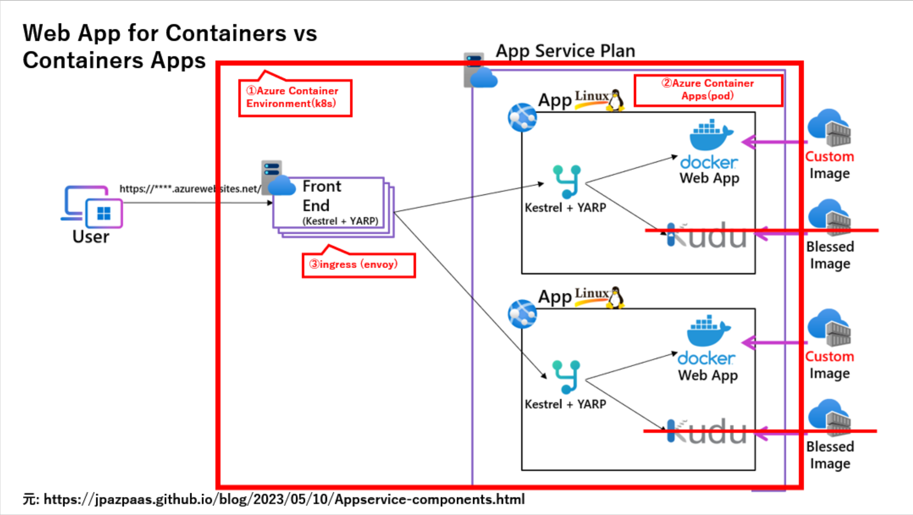

# Azure Contaner Apps の利用 :muscle:
<!-- _class: right -->

[Japan Azure User Group 13周年イベント](https://jazug.connpass.com/event/293744/)

 

###### by Takekazu Omi(*@Baleen.Studio*)

###### 2023/9/16 v1.0.0

 

# 自己紹介

近江 武一 [@takekazuomi](https://twitter.com/takekazuomi)

- 所属 [BALEEN STUDIO](https://baleen.studio)
- [仲間募集中](https://www.wantedly.com/projects/624553)
  - Go, Flutter など
- 13年、、、、光陰矢の如し
  [Tech Day 2010](https://codezine.jp/article/detail/4958#:~:text=%E9%96%8B%E7%99%BA%E3%82%92%E6%89%8B%E3%81%8C%E3%81%91%E3%81%9F%E3%83%AA%E3%83%BC%E3%83%89%E3%83%BB%E3%83%AC%E3%83%83%E3%82%AF%E3%82%B9%E3%81%AE%E8%BF%91%E6%B1%9F%E6%AD%A6%E4%B8%80%E6%B0%8F%E3%81%AF%E3%80%8CWindows%20Azure%E3%81%B8%E3%81%AE%E7%A7%BB%E8%A1%8C%E3%81%AF%E3%83%8F%E3%83%9E%E3%82%8B%E3%83%9D%E3%82%A4%E3%83%B3%E3%83%88%E3%82%92%E3%81%84%E3%81%8F%E3%81%A4%E3%81%8B%E6%8A%BC%E3%81%95%E3%81%88%E3%81%A6%E3%81%8A%E3%81%91%E3%81%B0%E9%9B%A3%E3%81%97%E3%81%8F%E3%81%AA%E3%81%84)

# **今日の話**

[Azure Container Apps](https://azure.microsoft.com/en-us/products/container-apps) は、:+1: って話。
###### APIの集合体でサービスを作って、そこにアプリ(UI)を乗せるには最適

- Azure Container Apps(以下ACA) とは
- マイクロサービスアーキテクチャ とかは割りとどうでもよい :smile_cat:
- Pros and Cons

# **[Azure Container Apps](https://azure.microsoft.com/en-us/products/container-apps)(ACA)とは**

## In short

- ACA: Azure Continer Environment(以下ACE)を足回りにした、マネージドなコンテナ実行環境
- ACE: Kubernetes(以下k8s)の複雑性を隠ぺいし高いスケーラビリティと可用性を実現
- マイクロサービスアーキテクチャに適した実行環境の提供

# **ACA の特徴**

- コンテナ向けのPaaS
  - [App Service](https://azure.microsoft.com/ja-jp/products/app-service) は、Webアプリ向けのPaaS
  - ACA は、コンテナ向けのPaaS
  - App Service PlanがACEで、App Service が、ACAの関係
- [KEDA](https://keda.sh/)による動的なスケーリング
  - TODO

###### ※ACAはコンテナを動かすことに特化している

# 

# ACAとApp Serviceの構成比較

- App Service は、Web サーバークラスタ上にWebアプリを配布
  - 課金単位は、App Service Plan
  - スケール単位は、App Service Planのノード数
  - Web アプリケーション前提(=http縛り)
- ACAは、コンテナオーケストレーター上にコンテナをデプロイ
  - 課金単位は、コンテナのリソース使用量(+ httpリクエスト)
  - スケール単位は、コンテナが実行されるレプリカの数
  - コンテナ前提（=http以外も可）

# サービス構成

- アプリは、コンテナでACAで実行
- クレデンシャルはAzure Key Vault
- Azure 内の認証はManaged Identity
- ACEは、VNet統合
- AzureリソースへはPrivateLinkでの接続
- 運用環境へのアクセスはAzure Bastion
- CIはGitHub Actions
- バックエンドの開発はGo

# コードの規模感

- 100万行程度、多分半分はテスト、コードは重複あり
- コンテナ数は、40ぐらい
- API数、grpc サービス数で約30、メソッド、rpc 300弱程度

※ バックエンドのAPI側のみ

# 開発中の雑感

- とりあえず、コードはコンテナに入れとく
  - ローカルでも、リモートでも動く
- 開発はローカルでできるようにする
  - ローカルで動かないと開発効率が悪い
  - ローカルで動かないと、テストが不便
  - エミュレータが無いAzureサービスが辛い
- Goは最高だけど
  - Azure SDKが足りん
  - go mod は、開発中のgo workと、git tagが辛い

# **マイクロサービスアーキテクチャ**

- :+1: マイクロサービスっぽく作ってみた。分けるのは嫌な面も多いけど、分けてしまえば独立して作れるのは魅力的
- :-1: 分けるのは良いけど、くっつけて動くのかという話はある。プラモデル製造は難しい
- :question: どのように分けるのかって話は、デザインの統一性と拡張性の問題でもある
  - ここは[AIP](https://google.aip.dev/)を使うことにした:fire:

# API Improvement Proposals(AIP)とは

APIの設計を統一するためのガイドライン。最重要ポイントの１つ :+1:

- APIには型安全とクライアントコード生成が必要
- :-1: REST API + Swagger は煩雑
- :+1: grpc + protobuf は、簡潔、型安全
- もっと高水準のAPI設計ガイドラインが必要
  - バラバラなAPIが300あったらアプリ開発は破綻する

# [AIP-121 リソース指向の設計](https://google.aip.dev/121)

- API の基本的な構成要素は、個別に名前が付けられたリソース (名詞) と、それらの間に存在する関係と階層
- 少数の標準メソッド(動詞) が、最も一般的な操作のセマンティクスを提供
  - 標準メソッドが適合しない状況ではカスタマイズメソッドを利用
- ステートレス プロトコル: クライアントとサーバー間の各リクエストは独立

※ 一貫性を持たせることで利用者にとってAPIの理解が容易になる

# 書籍

[APIデザインパターン](https://amzn.asia/d/9opqYtu)

[API Improvement Proposals(AIP)](https://google.aip.dev/)の本では無いが内容は被る、API設計の本のお勧め :+1:

# マイクロサービスアーキテクチャ? :smile_cat:

- [分割統治](https://ja.wikipedia.org/wiki/%E5%88%86%E5%89%B2%E7%B5%B1%E6%B2%BB)は、ソフトウェアの王道
- 分けてしまえば、バラバラに作れる
  - [ピザ2枚チーム](https://aws.amazon.com/jp/executive-insights/content/amazon-two-pizza-team/)のためにも分割は重要
- スレッショルドと、チームサイズ(7y ago)
  - <https://www.slideshare.net/takekazuomi/servcie-fabric-and-cloud-design-pattern/20>

# マイクロサービスアーキテクチャ 別視点(1) :smile_cat:

**永続化** :small_airplane:

- DB集約型はスケーラビリティに問題がある
- DBは結局グローバル変数でコントロールが難しい
- DBを頑張って設計するか、APIを頑張るか
- DBもシングルで行ける範囲は限りがあり、分けざる得ない
  - 分け方は垂直、水平。極限では両方必要。
  - 最初は、垂直に分けて。足りなくなったら、その中を水平。
  - 分けてしまうとトランザクションに頼れなくなる

# マイクロサービスアーキテクチャ 別視点(2) :smile_cat:

**スコープを狭める** :small_airplane: :small_airplane:

- コードとデータは近くに置く
  - グローバル変数を避けて、モジュールに隠ぺいする
  - DBはグローバル変数化しやすい
  - APIはサービス固有のストレージを持つ
- [polygot persistance](https://martinfowler.com/bliki/PolyglotPersistence.html) は、ほどほどに
  - あまり異なったものを混ぜると、運用が大変に :-1:
  - 今回はMySQLに統一。でもDatabaseは別

# マイクロサービスアーキテクチャ 別視点(3) :smile_cat:

**コードベースを小さく保つ** :small_airplane: :small_airplane: :small_airplane:

- レイヤーの積み重ねを避け、コードベースをシンプルに保つ
- 個々のAPIの実装は、小機能で完結するようになる＝コードベースが小さくなる
- 従来のMVCモデルのような考え方でさえ、API実装には不要
  - APIの実装では、[Clean Architecture](https://blog.cleancoder.com/uncle-bob/2012/08/13/the-clean-architecture.html)のような、Controller/Use Case/Entityのような階層構造も複雑すぎる
- コードベースを小さく保ち、コードの理解を容易にすることが重要

# マイクロサービスアーキテクチャ 小まとめ

- マイクロサービスアーキテクチャかどうかはあまり重要ではない
- 分割統治、チームサイズが重要
- 分割し、IFを固定することが重要
  - IFを固定することで、独立性が向上する

総じてIFを決める部分がコスト高。とは言ってもこの手のものがますます一般的な手法に。昔の[マイクロサービスアーキテクチャ](https://martinfowler.com/articles/microservices.html)とは、大分違う物になりつつあるので別の言葉が欲しい。

# Pros and Cons

- :+1: Pros
  - アプリケーションパッケージとしてのコンテナは使い勝手が良い。
    - 実行再現性が高く、余計なトラブルを減らしてくれる
  - ACAの管理性は高く、PaaSとして優良([NaaS](https://denniszielke.medium.com/using-azure-container-apps-at-scale-instead-of-your-building-your-own-naas-on-top-of-k8s-7c4760c2511f)っていうらしい)
  - ACAは、大量のコンテナ(まだ2桁だけど)を動かしたときのリソースコントロールがやりやすい
- :-1:Cons
  - 次のページへ

# Pros and Cons(2)

- :-1: Cons
  - 開発に必要がスキルが幅広い。API設計、DB設計など
  - くっつけて動かすときがコスト高（結合コスト高）
  - 常時結合は、頻繁に壊れてしまう
  - GoのApplication Insights 統合が辛い（Observabilityが低い）
  - Batch系は改善が必要。ACA Jobはもっと早く欲しかった
  - 設計上の失敗は、手戻りが大きい（なんでもだけど）

# **まとめ**

アプリケーションをコンテナにパッケージし、オーケストレーション環境にデプロイするということが割と簡単に実現出来るようになってきた。それにより、分割統治というソフトウェア開発の王道が上位のレイヤーで出来るようになり。結果、更にワンステップ上がった規模のサービス構築が視野に入ってきている:smile:

- 今回のコンテンツ、
  - GitHub [jazug13y-aca.md](https://github.com/takekazuomi/slide/blob/main/docs/20230915-jazug13y-aca.md)
  - pdf [jazug13y-aca.pdf](https://github.com/takekazuomi/slide/blob/main/docs/20230915-jazug13y-aca.pdf)
###### Powerd by [Marp](https://github.com/marp-team/marp-cli#docker)。ありがとうございました。

# 終

